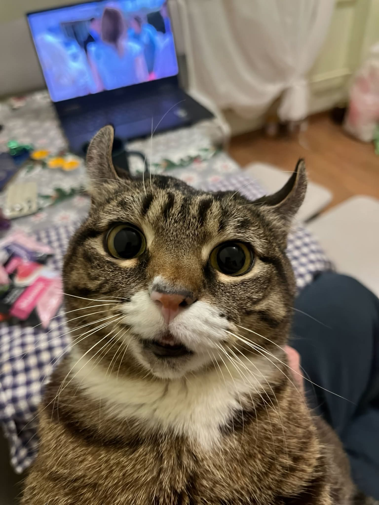

> <b>🚀 Versión actual: 1.0</b>
 
<p align="center"> 
<a href="https://github.com/elrebelde21"></a> 
</p>

<p align="center">

</p>

<p align="center">
<a href="#"></a> 

</p>  

<a href="https://github.com/GataNina-Li"></a> 


<div align="center">
<a href="https://facebook.com/groups/872989990425789/">

</a>
<a href="https://www.youtube.com/@elrebelde.21">

</a>
<a href="https://tiktok.com/@elrebeldeofc" target="_blank"> </a> 
</a>
<a href="https://www.instagram.com/mitzuki_chinita" target="_blank"> </a> 
</a>    
<a href="https://paypal.me/OficialGD" target="_blank"> </a> 
</a>
 
 [](https://atom.bio/lolibot)
</div>


### `📝 NOTA 📝`
```bash
🔸ESTE REPOSITORIO SE PUBLICA LA VERSIÓN ACTUAL|OFICIAL DE LOLIBOT-MD
🔸ES POSIBLE QUE EL BOT TENGA ALGUNAS FALLAS, SE IRAN SOLUCIONANDO CONFORME SE VAYAN DETECTANDO
🔸SI VAS A EDITAR POR COMPLETO DEJA LOS CRÉDITOS DEL BOT
🔸ATENTO A LAS NUEVAS ACTUALIZACIÓNES QUE SE HAGAN EN ESTE REPOSITORIO
🔸EL ADD/KICK PUEDEN OCASIONAR QUE EL NÚMERO SE VAYA A SOPORTE POR ELLO SE ACTIVA CON #enable restrict
🔸 LOLIBOT-MD, NO SE HACE RESPONSABLE DEL USO, NÚMERO, PRIVACIDAD Y CONTENIDO MANDADO, O USADO O GESTIONADO POR USTEDES O EL BOT (usarlo bajo tu responsabilidad). 
```
----

### 🌟 EDITOR Y PROPIETARIO DEL BOT
<a href="https://github.com/elrebelde21"></a>


